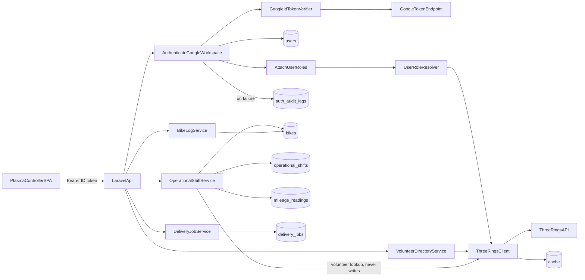

# Architecture

## Summary

Plasma API is a thin Laravel JSON layer in front of Google Workspace identity and Three Rings volunteer data. The Plasma Controller SPA obtains a Google ID token and calls `/api/*` with `Authorization: Bearer …`. Middleware verifies the token, enforces the Workspace domain, provisions a local `User`, then resolves Plasma roles from the cached Three Rings directory by matching the user's email. Controllers stay thin; business rules belong in services.

## Components

| Component | Responsibility | Location |
|-----------|----------------|----------|
| HTTP API | Public JSON routes under `/api` | `routes/api.php`, `bootstrap/app.php` |
| Access control | Capability matrix + admin hierarchy | `app/Authorization/`, `EnsureHasCapability` (`access`) |
| Workspace auth middleware | Verify ID token, domain, provision user | `app/Http/Middleware/AuthenticateGoogleWorkspace.php` |
| Role attachment middleware | Resolve Plasma roles from Three Rings directory | `app/Http/Middleware/AttachUserRoles.php` |
| Role resolver | Match email to volunteer; map Three Rings role names | `app/Services/Roles/UserRoleResolver.php` |
| ID token verifier | `Google\Client::verifyIdToken` | `app/Services/Auth/GoogleApiClientIdTokenVerifier.php` |
| User + audit models | Persist identity; log auth failures | `app/Models/User.php`, `app/Models/AuthAuditLog.php` |
| Three Rings client | Read-only directory and shift fetches + cache | `app/Services/ThreeRings/` |
| Operational shifts | Plasma-owned logon/logoff with bike mileage | `app/Services/Shifts/` |
| Delivery jobs | Create, relay, lifecycle actions, list by scope | `app/Services/Jobs/` |
| Volunteer directory | Search Three Rings volunteers (read-only) | `app/Services/Directory/VolunteerDirectoryService.php` |
| Bike log | Search bikes; detail with mileage history | `app/Services/Bikes/BikeLogService.php` |
| CORS | Allow SPA origins | `config/cors.php` |
| GCP hosting | Cloud Run, Cloud SQL, Secret Manager, WIF | `infrastructure/` |

## Data / control flow

### Auth and role sequence

1. SPA sends `Authorization: Bearer <Google ID token>` to a route using `auth.google`.
2. Middleware reads `GOOGLE_CLIENT_ID` / `GOOGLE_ALLOWED_DOMAIN` from config (`config/services.php`, `config/auth.php`).
3. Verifier checks signature and `aud`; middleware requires `email_verified` and Workspace domain (`hd` + email suffix).
4. User is linked/created by `google_id` (fallback: email); `Auth::setUser(...)`.
5. `AttachUserRoles` runs on the `auth.google` group: fetches cached `GET /directory.json`, finds the volunteer whose `email` or `email_alt` matches the signed-in user, maps Three Rings role names to Plasma roles (`controller`, `rider`, `driver`, `trustee`), and adds `admin` when `users.is_admin` is true.
6. Resolved roles are attached to the request and exposed on `/api/me` as a `roles` string array. The API does not return a separate `is_admin` flag.
7. Failures in step 1–4 write `AuthAuditLog` and `storage/logs/auth.log` (`config/logging.php`); 401 for missing/invalid token, 403 for unverified or out-of-domain.
8. Three Rings outage during role resolution yields empty Three Rings-derived roles (admin still applies if set locally).

Local bypass: `AUTH_DISABLED` only when `APP_ENV` is `local` or `testing`.

## Key modules

- `app/Contracts/GoogleIdTokenVerifier.php` — verifier interface; bound in `app/Providers/AppServiceProvider.php`
- `app/Enums/AuthFailureReason.php` — audit failure reasons
- `app/Services/ThreeRings/ThreeRingsClient.php` — GET-only client (`/directory.json`, `/shift.json`); rate limit, configurable timeouts, fresh/stale cache, structured logging; never writes to Three Rings (BR-005)
- `app/Services/ThreeRings/Data/Volunteer.php` — Parses live directory volunteer records (code-keyed properties, regional role names)
- `app/Enums/Role.php` — Maps Three Rings role names to Plasma roles (prefix match for regional riders/trustees; exact match for Controller)
- `app/Services/Shifts/OperationalShiftService.php` — logon/logoff, one active shift per rider and bike, mileage history on logoff
- `app/Services/Jobs/DeliveryJobService.php` — create, relay, allocate/collect/deliver/cancel; list active and completed top-level jobs
- `app/Services/Jobs/RelayJobStatusAggregator.php` — derive parent relay status from leg progress
- `app/Services/Directory/VolunteerDirectoryService.php` — filter cached Three Rings volunteers by name, role, area
- `app/Services/Bikes/BikeLogService.php` — search bikes by registration; load mileage history
- `app/Http/Controllers/Api/DirectoryController.php` — directory HTTP surface (`view-directory`)
- `app/Authorization/CapabilityMatrix.php` — which roles may use each named capability; admin is expanded in `Role::expand()`
- `database/migrations/` — `users`, `auth_audit_logs`, `bikes`, `operational_shifts`, `mileage_readings`, `delivery_jobs`, cache/jobs tables

## Current HTTP surface

Do not document routes that are not registered.

| Method | Path | Auth | Response |
|--------|------|------|----------|
| GET | `/up` | none | Health |
| GET | `/api/` | none | `{ "name": <app.name> }` |
| GET | `/api/me` | `auth.google` | Authenticated user JSON with `roles` array (no `is_admin` field) |
| GET | `/api/shifts/active` | `auth.google` + any Plasma role | `{ "data": [ ActiveShift, … ] }` camelCase |
| GET | `/api/bikes` | `auth.google` + controller or trustee (`view-bikes`) | `{ "data": [ { id, registration, area, status, lastRecordedMileage, purchasedAt? } ] }` — active bikes for shift logon; optional `status` / `area` query filters require `manage-bikes` |
| POST | `/api/bikes` | `auth.google` + trustee/admin (`manage-bikes`) | Create bike; body `{ registration, area, lastRecordedMileage, purchasedAt? }`; 201 |
| PATCH | `/api/bikes/{id}` | `auth.google` + trustee/admin (`manage-bikes`) | Update registration, area, purchasedAt |
| POST | `/api/bikes/{id}/retire` | `auth.google` + trustee/admin (`manage-bikes`) | Retire bike (no hard delete) |
| GET | `/api/volunteers` | `auth.google` + controller (`view-volunteers`) | `{ "data": [ { id, name } ] }` from Three Rings — rider picker at logon |
| GET | `/api/directory/volunteers` | `auth.google` + any Plasma role (`view-directory`) | Volunteer search; query `q`, `role`, `area` (all optional; empty if all blank) |
| GET | `/api/directory/bikes` | `auth.google` + any Plasma role (`view-directory`) | Bike search by registration; query `q` (empty if blank) |
| GET | `/api/directory/bikes/{id}` | `auth.google` + any Plasma role (`view-directory`) | Bike detail with `mileageHistory` |
| POST | `/api/shifts/logon` | `auth.google` + controller (admin via hierarchy) | ActiveShift camelCase (`riderId`, `startMileage`, …) |
| POST | `/api/shifts/{shift}/logoff` | `auth.google` + controller (admin via hierarchy) | ActiveShift; body `{ endMileage, faults? }` |
| GET | `/api/jobs/{scope}` | `auth.google` + any Plasma role | `{ "data": [ DeliveryJob, … ] }` for `active` (New/Allocated/Collected) or `completed` (Delivered/Cancelled) |
| POST | `/api/jobs` | `auth.google` + controller (`create-job`) | Delivery job camelCase (`reference`, `status: New`, Places `collection`/`delivery`); 201 |
| POST | `/api/jobs/{id}/relay` | `auth.google` + controller (`create-job`) | Convert a New job to relay; body `{ rendezvousPoints: [ Places location, … ] }`; creates legs `{reference}-L{n}` |
| POST | `/api/jobs/{id}/actions/allocate` | `auth.google` + controller (`create-job`) | New → Allocated; body `{ shiftId }` (active operational shift) |
| POST | `/api/jobs/{id}/actions/collect` | `auth.google` + controller (`create-job`) | Allocated → Collected; body `{ contentsConfirmed, suitablySealed, receiptNumber, sealNumber?, collectedAt? }` |
| POST | `/api/jobs/{id}/actions/deliver` | `auth.google` + controller (`create-job`) | Collected → Delivered; body `{ recipient, deliveredAt? }` |
| POST | `/api/jobs/{id}/cancel` | `auth.google` + controller (`create-job`) | Cancel job (or relay parent + open legs); body `{ reason? }` |

## Persistence and caching

| Store | Use |
|-------|-----|
| PostgreSQL 17 (Sail / Cloud SQL) | Users, auth audit logs, bikes, operational shifts, mileage readings, delivery jobs, jobs/cache tables |
| SQLite `:memory:` | PHPUnit |
| Cache store (`database`) | Three Rings fresh/stale TTLs; shared across Cloud Run instances |

Three Rings cache lifetimes (seconds) live under `config/services.php` → `three_rings.cache` (volunteers/directory, shifts). HTTP timeouts: `THREE_RINGS_TIMEOUT_SECONDS` (default 30), `THREE_RINGS_CONNECT_TIMEOUT_SECONDS` (default 5). Rate budget: 15 attempts / 60s fixed window (comments explain BR-005 GET-only and BR-008 stale fallback).

## Integrations

| System | Direction | Purpose |
|--------|-----------|---------|
| Plasma Controller SPA | Inbound (CORS + Bearer token) | UI; origins from `FRONTEND_URL` |
| Google OAuth / Workspace | Inbound token verification | Sign-in identity (`GOOGLE_CLIENT_ID`, `GOOGLE_ALLOWED_DOMAIN`) |
| Three Rings (`3r.org.uk`) | Outbound GET | Volunteer directory (`directory.json`) and shifts — read-only; roles taken from each volunteer record, not a separate admin API |
| GCP Secret Manager | Config storage | `APP_KEY`, DB password, OAuth client ID, Three Rings API key |

## Failure modes

- Invalid or missing Bearer token → 401; audit + `auth` log channel
- Unverified email or wrong Workspace domain → 403
- Signed-in user with no Plasma roles → 200 on `/api/me`, 403 on every other protected route
- Logon/logoff, bikes, volunteers, job writes, or relay without controller (or admin) → 403
- Directory routes without any Plasma role → 403
- Directory volunteer search with all query params blank → empty result (not an error)
- Directory bike search with blank `q` → empty result
- Volunteer directory when Three Rings is unavailable → 503
- Job action on wrong status (e.g. collect when New) → 422 with allowed actions
- Lifecycle actions on a relay parent (not a leg) → 422 — manage legs individually
- Relay conversion when job is not New, already relay, or is a leg → 422
- Allocate with inactive or unknown shift → 422
- Client `X-Active-Role` (and similar) headers are ignored; roles come only from Three Rings directory lookup plus local `users.is_admin` (surfaced as the `admin` role)
- Duplicate active shift (same rider or bike), unknown rider, or mileage variance without a reason → 422 with field errors
- Job locations missing place ID, coordinates, or address → 422 with field errors
- Unknown job list scope (not `active` or `completed`) → 404
- Three Rings directory unavailable at logon (and no cache) → 503
- Three Rings rate limit or outage → client prefers fresh cache, else stale (BR-008); no write-back to Three Rings
- Terraform apply without Console OAuth client → you must supply `google_client_id`; TF cannot create the client
- Cloud Run scale-out races if you migrate on HTTP boot; use the `plasma-api-migrate` job instead

## Conventions

From [README.md](../README.md): thin controllers; rules in services; write endpoints validate server-side with structured field errors (when writes exist).
