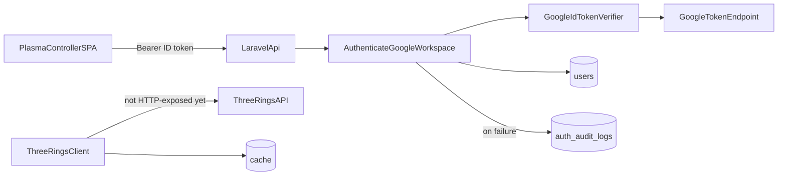

# Architecture

## Summary

Plasma API is a thin Laravel JSON layer in front of Google Workspace identity and (soon) Three Rings volunteer data. The Plasma Controller SPA obtains a Google ID token and calls `/api/*` with `Authorization: Bearer …`. Middleware verifies the token, enforces the Workspace domain, and provisions a local `User`. Controllers stay thin; business rules belong in services.

## Components

| Component | Responsibility | Location |
|-----------|----------------|----------|
| HTTP API | Public JSON routes under `/api` | `routes/api.php`, `bootstrap/app.php` |
| Workspace auth middleware | Verify ID token, domain, provision user | `app/Http/Middleware/AuthenticateGoogleWorkspace.php` |
| ID token verifier | `Google\Client::verifyIdToken` | `app/Services/Auth/GoogleApiClientIdTokenVerifier.php` |
| User + audit models | Persist identity; log auth failures | `app/Models/User.php`, `app/Models/AuthAuditLog.php` |
| Three Rings client | Read-only volunteer/role/shift fetches + cache | `app/Services/ThreeRings/` |
| CORS | Allow SPA origins | `config/cors.php` |
| GCP hosting | Cloud Run, Cloud SQL, Secret Manager, WIF | `infrastructure/` |

## Data / control flow

### Auth sequence

1. SPA sends `Authorization: Bearer <Google ID token>` to a route using `auth.google`.
2. Middleware reads `GOOGLE_CLIENT_ID` / `GOOGLE_ALLOWED_DOMAIN` from config (`config/services.php`, `config/auth.php`).
3. Verifier checks signature and `aud`; middleware requires `email_verified` and Workspace domain (`hd` + email suffix).
4. User is linked/created by `google_id` (fallback: email); `Auth::setUser(...)`.
5. Failures write `AuthAuditLog` and `storage/logs/auth.log` (`config/logging.php`); 401 for missing/invalid token, 403 for unverified or out-of-domain.

Local bypass: `AUTH_DISABLED` only when `APP_ENV` is `local` or `testing`.

## Key modules

- `app/Contracts/GoogleIdTokenVerifier.php` — verifier interface; bound in `app/Providers/AppServiceProvider.php`
- `app/Enums/AuthFailureReason.php` — audit failure reasons
- `app/Services/ThreeRings/ThreeRingsClient.php` — GET-only client (directory, roles, shifts); rate limit and fresh/stale cache in `config/services.php` → `three_rings`
- `database/migrations/` — `users`, `auth_audit_logs`, cache/jobs tables

## Current HTTP surface

Do not document routes that are not registered.

| Method | Path | Auth | Response |
|--------|------|------|----------|
| GET | `/up` | none | Health |
| GET | `/api/` | none | `{ "name": <app.name> }` |
| GET | `/api/me` | `auth.google` | Authenticated `User` JSON |

## Persistence and caching

| Store | Use |
|-------|-----|
| PostgreSQL 17 (Sail / Cloud SQL) | Users, auth audit logs, jobs/cache tables |
| SQLite `:memory:` | PHPUnit |
| Cache store (`database`) | Three Rings fresh/stale TTLs; shared across Cloud Run instances |

Three Rings cache lifetimes (seconds) live under `config/services.php` → `three_rings.cache` (volunteers, roles, shifts). Rate budget: 15 attempts / 60s fixed window (comments explain BR-005 GET-only and BR-008 stale fallback).

## Integrations

| System | Direction | Purpose |
|--------|-----------|---------|
| Plasma Controller SPA | Inbound (CORS + Bearer token) | UI; origins from `FRONTEND_URL` |
| Google OAuth / Workspace | Inbound token verification | Sign-in identity (`GOOGLE_CLIENT_ID`, `GOOGLE_ALLOWED_DOMAIN`) |
| Three Rings (`3r.org.uk`) | Outbound GET | Volunteers, roles, shifts (`THREE_RINGS_*`) — service only today |
| GCP Secret Manager | Config storage | `APP_KEY`, DB password, OAuth client ID, Three Rings API key |

## Failure modes

- Invalid or missing Bearer token → 401; audit + `auth` log channel
- Unverified email or wrong Workspace domain → 403
- Three Rings rate limit or outage → client prefers fresh cache, else stale (BR-008); no write-back to Three Rings
- Terraform apply without Console OAuth client → you must supply `google_client_id`; TF cannot create the client
- Cloud Run scale-out races if you migrate on HTTP boot; use the `plasma-api-migrate` job instead

## Conventions

From [README.md](../README.md): thin controllers; rules in services; write endpoints validate server-side with structured field errors (when writes exist).
