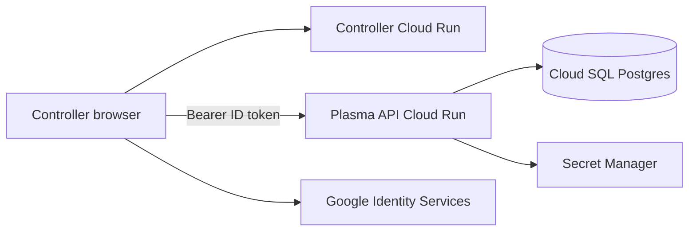

# GCP hosting

## Purpose

How Plasma API is hosted on Google Cloud Platform. This app is a Laravel JSON API. **This repo deploys the API to Cloud Run** in `europe-west2` via Terraform workspaces (`staging` / `production`), with Cloud SQL PostgreSQL 17 and Secret Manager. Cache is Laravel’s database store (no Memorystore Redis in this pass).

Operational steps (bootstrap, apply, GitHub Environments) are in [Cloud Run deploy](cloud-run.md).

## What we are hosting

A FrankenPHP container that serves Laravel on port 8080:

| Piece | Role |
|-------|------|
| Cloud Run service `plasma-api` | HTTPS JSON API (`/up`, `/api/*`) |
| Cloud Run job `plasma-api-migrate` | `php artisan migrate --force` after each deploy |
| Cloud SQL PostgreSQL 17 | Users, auth audit logs, cache and jobs tables |
| Secret Manager | `APP_KEY`, DB password, Google client ID, Three Rings API key |

Runtime config is injected as Cloud Run env (plain values and secret refs). Do not bake secrets into the image.

## How this fits Plasma Controller

Plasma Controller is a public SPA on Cloud Run in the same projects and region. The browser calls this API with a Google ID token. CORS uses `FRONTEND_URL`, sourced from the Controller Cloud Run URI unless `frontend_url_override` is set.

The SPA and API must share the **same Google OAuth Web client ID**. After the API has a URL, add it to the OAuth client if you use authorised APIs; add the SPA origin to `FRONTEND_URL` (automatic when the Controller service exists).

BR-011 (data and compute in `europe-west2`) applies to this API.

## Options considered

| Option | Verdict |
|--------|---------|
| Cloud Run + Cloud SQL + database cache | **Chosen.** Matches Controller CI/CD, PLM-19, and current Laravel defaults. |
| Cloud Functions + Datastore | Beeper’s stack. Wrong for a relational Laravel API. |
| GKE | Operationally heavy for this traffic. |
| Memorystore Redis | Deferred. Needs a VPC; database cache is shared across instances. |
| Cloud SQL MySQL | Local Sail now matches Postgres; Postgres has a native `uuid` type for later PK work. |

## In-repo path

**Host the API on Cloud Run** on `plasma-staging-502110` / `plasma-production`, region `europe-west2`. Cloud SQL has a public IP with **no authorised networks** and **`ssl_mode = ENCRYPTED_ONLY`**; only the Cloud Run Cloud SQL connector (encrypted Unix socket) can reach it. No custom domain in this pass.

## Key paths

| Path | Role |
|------|------|
| `Dockerfile` | FrankenPHP production image |
| `docker/entrypoint.sh` | `config:cache` / `route:cache` then FrankenPHP |
| `infrastructure/` | Terraform root (workspaces + tfvars) |
| `.github/workflows/ci.yml` | Pint, PHPUnit, Terraform validate; staging deploy on PRs |
| `.github/workflows/terraform.yml` | `terraform fmt` / `validate` |
| `.github/workflows/deploy.yml` | Image push, `terraform apply`, migrate job |
| [Cloud Run deploy](cloud-run.md) | Bootstrap and operate |

## Pitfalls

- Pair workspace and tfvars. Never apply `production.tfvars` while the `staging` workspace is selected.
- First GitHub Actions deploy needs Artifact Registry, WIF, Cloud SQL, and `roles/storage.admin` on `gs://plasma-api-tfstate` from a laptop apply.
- The first Cloud Run revision may use the placeholder hello image until CI pushes FrankenPHP; `/up` will fail until then.
- Do not run `php artisan migrate` on every HTTP instance start (race under scale-out). Use the migrate job.
- Auth log channel writes files locally; Cloud Run sets `LOG_AUTH_CHANNEL=stderr`.
- Converting integer primary keys to UUID is **not** part of this hosting work.

## Related

- [Cloud Run deploy](cloud-run.md)
- [Technical overview](overview.md)
- [Architecture](architecture.md)
- [PLM-1 Plasma API MVP](https://bloodbikeswales.atlassian.net/browse/PLM-1)
- [PLM-19 Serverless deployment on GCP](https://bloodbikeswales.atlassian.net/browse/PLM-19)
